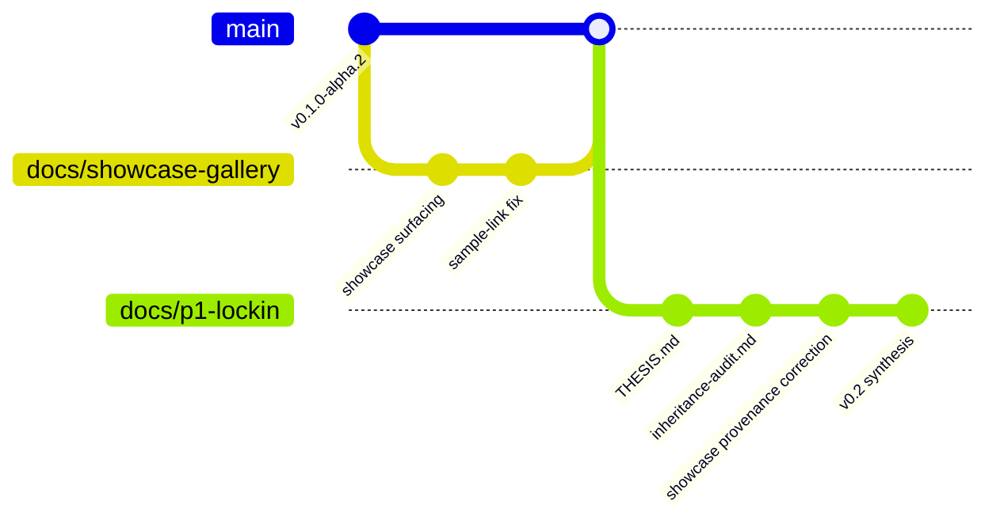

# v0.2 Synthesis

> **Purpose.** This page is the merge brief for the current v0.2 lock-in pass. It explains
> how the branch-level work fits together, which claims are now locked, which surfaces
> were corrected for public readability, and what `main` should inherit once this PR lands.

**Companion docs**

- [`THESIS.md`](THESIS.md) — the smallest locked statement page
- [`inheritance-audit.md`](inheritance-audit.md) — keep / promote / revise / retire matrix
- [`../SHOWCASE.md`](../SHOWCASE.md) — public-facing artifact gallery

---

## 1. What this pass is actually doing

This merge is not a grab-bag of docs edits. It is a consolidation pass with three goals:

1. Lock the thesis so the repo stops arguing with itself.
2. Audit what survives from the hackathon and early-alpha phase.
3. Correct the public showcase so the files we point people to are the files we mean.

The result is a repo that is easier for both humans and agents to navigate:

- humans get a clearer statement of what Wittgenstein is and is not
- agents get explicit inheritance boundaries instead of implicit lore
- `main` gets a safer public narrative and a more honest showcase surface

---

## 2. The storyline across branches

Read from left to right:

- `docs/showcase-gallery` made the 35-artifact pack visible from the repo root and README.
- That work already landed in `main`.
- `docs/p1-lockin` builds on top of that and does the real v0.2 cleanup:
  - locks the thesis
  - classifies repo inheritance explicitly
  - corrects showcase provenance for the image sample
  - packages the whole thing into a mergeable narrative

---

## 3. Change map

| Workstream | Why it exists | Main files |
|---|---|---|
| Thesis lock-in | Stop drift in the core claim | [`THESIS.md`](THESIS.md) |
| Inheritance audit | Make implicit repo beliefs explicit | [`inheritance-audit.md`](inheritance-audit.md) |
| Showcase provenance correction | Fix the public sample image so it matches verified local workflow output | [`../SHOWCASE.md`](../SHOWCASE.md), [`../artifacts/showcase/workflow-examples/`](../artifacts/showcase/workflow-examples/) |
| Regeneration guardrail | Prevent future showcase reruns from silently restoring the wrong image sample | [`../scripts/generate_workflow_examples.ts`](../scripts/generate_workflow_examples.ts) |
| Merge brief / handoff | Give humans and agents one readable synthesis page | this file |

---

## 4. What is now locked

These statements are no longer "probably true" or "how we happened to talk about it."
They are now explicit repo doctrine unless superseded by ADR:

| Locked statement | Where locked |
|---|---|
| Wittgenstein is the modality harness for text-first LLMs | [`THESIS.md`](THESIS.md) |
| Modality capability is added outside the base model | [`THESIS.md`](THESIS.md) |
| Five-layer foundation (L1–L5) remains the architectural bet | [`THESIS.md`](THESIS.md) |
| Decoder ≠ generator | [`THESIS.md`](THESIS.md), [`inheritance-audit.md`](inheritance-audit.md) |
| Reproducibility via manifest + seed + artifact hash is a product feature | [`THESIS.md`](THESIS.md) |
| Chameleon/LlamaGen-style full retrain is not our path | [`THESIS.md`](THESIS.md), [`inheritance-audit.md`](inheritance-audit.md) |
| Silent fallbacks are not acceptable | [`THESIS.md`](THESIS.md), [`inheritance-audit.md`](inheritance-audit.md) |

---

## 5. What this pass clarifies instead of locking

Not everything should be frozen yet. Some things needed to be named and parked.

| Category | Meaning | Examples |
|---|---|---|
| `Promote` | already believed, not yet written well enough | compression framing, METR / harness evidence, adapter universality hypothesis |
| `Revise` | open question with a named decision venue | one-call vs two-call image pipeline, middleware naming, website/repo reconciliation |
| `Retire` | legacy scaffold that should leave once replaced | request-level strategy fields, harness-owned modality branching, route boilerplate |
| `Parked` | explicitly out of scope for this phase | real decoder bridge, new modalities, real perceptual benchmarks |

That classification is the point of [`inheritance-audit.md`](inheritance-audit.md): no silent
survivors, no silent deletions.

---

## 6. Showcase correction

This pass also fixes a public-facing mismatch in the image showcase.

### The problem

The previously surfaced `02-forest` image was not the intended workflow example. It had
been replaced by a later bridge output and no longer matched the verified local sample the
team actually wanted to show.

### The correction

- `artifacts/showcase/workflow-examples/image/02-forest.png` is now pinned to the
  verified local prior-run image selected by the user.
- `artifacts/showcase/workflow-examples/samples/image/02-forest.png` mirrors that same
  verified file.
- `artifacts/showcase/workflow-examples/samples/image/03-forest-alt.png` preserves the
  second verified local image as an additional reference example.
- the showcase entry points now point to `samples/` first, not to whatever happened to be
  in the broader pack

### The regeneration rule

`scripts/generate_workflow_examples.ts` now knows that `02-forest` can be overridden by a
curated local source under:

`artifacts/showcase/workflow-examples/curated/image/02-forest.png`

That means future reruns do not silently restore the wrong public sample.

---

## 7. Human reading order

If you are a human maintainer, read in this order:

1. [`THESIS.md`](THESIS.md)
2. [`inheritance-audit.md`](inheritance-audit.md)
3. [`../README.md`](../README.md)
4. [`../SHOWCASE.md`](../SHOWCASE.md)

This gives you:

- what the project is
- what survives from the current repo
- what outsiders see first
- what concrete artifacts back the claim

---

## 8. Agent reading order

If you are an agent entering the repo mid-stream, read in this order:

1. [`../AGENTS.md`](../AGENTS.md)
2. [`THESIS.md`](THESIS.md)
3. [`inheritance-audit.md`](inheritance-audit.md)
4. [`../docs/architecture.md`](architecture.md)
5. [`../SHOWCASE.md`](../SHOWCASE.md)

That sequence answers five questions in order:

1. What constraints are hard?
2. What thesis is locked?
3. What carries forward and what does not?
4. Where does each layer live in code?
5. What public-facing files must remain correct?

---

## 9. What `main` should inherit after this PR

After merge, `main` should inherit four durable improvements:

1. A single thesis page that future ADRs can explicitly supersede.
2. An inheritance ledger that turns repo cleanup into named decisions rather than vibes.
3. A corrected showcase sample image with stronger provenance discipline.
4. A synthesis page that future PRs can update instead of re-explaining the repo from scratch.

---

## 10. Known limits

- The additional image examples are verified local workflow outputs, but their original
  upstream repo location could not be re-established automatically from the current local
  git checkout set.
- The showcase correction is honest about provenance: the curated image is pinned as a
  verified local prior-run output rather than pretending it came from the later bridge run.
- This pass improves public readability and merge safety; it does not yet land the larger
  RFC / ADR retirement sequence described in the inheritance audit.

---

## 11. What shipped after this merge (P2 → P5)

The P1 synthesis above set up four immediate next moves. All four have since landed as
dated PRs and are now either merged or in review:

| Phase | PR | Outputs | Status |
|---|---|---|---|
| P2a | [#7](https://github.com/wittgenstein-cli/wittgenstein/pull/7) | Briefs A (VQ/VLM lineage), B (Ilya↔LeCun, critical-path), C (horizon scan) | merged |
| P2b | [#33](https://github.com/wittgenstein-cli/wittgenstein/pull/33) | Briefs D (CLI conventions), E (benchmarks v2), F (site reconciliation) | open |
| P3 | [#34](https://github.com/wittgenstein-cli/wittgenstein/pull/34) | RFCs 0001 (Codec Protocol v2), 0002 (CLI ergonomics), 0003 (Naming: Loom/Transducer/Score/Handoff), 0004 (Site) | open |
| P4 | [#35](https://github.com/wittgenstein-cli/wittgenstein/pull/35) | ADRs 0006 (Layered epistemology), 0007 (Path-C rejected), 0008 (Codec v2 adoption), 0009 (CLI v2), 0010 (Naming locked) | open |

The critical-path verdict from Brief B — **Position (iii) Layered + (iv) Agnostic
contract** — is now load-bearing via ADR-0006. Every downstream decision inherits from
that stance.

## 12. What is now permanent vs still open

**Permanent (ADR-backed):**

- Thesis: "the modality harness for text-first LLMs"
- L1–L5 architecture, decoder ≠ generator, no silent fallbacks, RunManifest spine
- Layered epistemology (ADR-0006) — `Handoff = Text | Latent | Hybrid` sum type; only `Text` ships at v0.2
- Path C rejected (ADR-0007) — no full multimodal retrain through v0.4
- Codec Protocol v2 (ADR-0008) — kill date for pre-v2 surface is v0.3.0
- CLI ergonomics v2 (ADR-0009) — NDJSON contract, two deliberate divergences (no REPL, no user-facing `--model`)
- Naming locked (ADR-0011, supersedes ADR-0010) — Harness / Codec / Spec / IR / Decoder / Adapter / Packaging; "Parasoid" retires. The RFC-0003 rename (Loom / Transducer / Score / Handoff) was reverted in `docs/v02-alignment-review.md` §2.2 because the existing PPT / `AGENTS.md` vocabulary was already correct.

**Still open (returns in P6 — separate execution plan):**

- Actual code port: sensor → audio → image per RFC-0001 §Migration
- Benchmarks v2 bridge per Brief E's metric picks
- Site rewrite per RFC-0004 (site-ops PR, separate repo)
- Showcase regeneration against the Codec v2 surface once migrated

## 13. Governance

- `docs/tracks.md` — the contract between researcher and hacker tracks.
- `docs/rfcs/README.md` + `docs/rfcs/00_template.md` — RFC process and template.
- Two-hats review (Researcher + Hacker) is enforced on every brief, RFC, and ADR.

