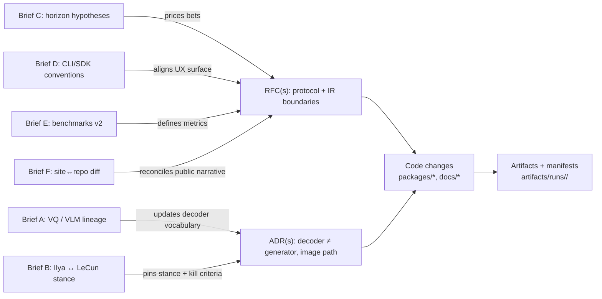

# Research Briefs

First-pass research briefs produced under **Phase P2** of the v0.2 Restructuring Action Outline. Each brief is a self-contained document that pressure-tests one claim, lineage, or engineering convention relevant to the Wittgenstein thesis.

## Brief index

| ID  | Title                                                                          | Question                                                                             | Status         |
| --- | ------------------------------------------------------------------------------ | ------------------------------------------------------------------------------------ | -------------- |
| A   | [VQ / VLM lineage 2026 refresh](A_vq_vlm_lineage_audit.md)                     | Does the VQ-token / frozen-decoder path still look like the right bet in April 2026? | 🟡 Draft v0.1  |
| B   | [Compression vs world models — Ilya ↔ LeCun](B_compression_vs_world_models.md) | Where does Wittgenstein stand on the Ilya/LeCun tension? _(critical-path brief)_     | 🟡 Draft v0.1  |
| C   | [Unproven-but-interesting horizon scan](C_unproven_horizon.md)                 | Which 6–8 unvalidated hypotheses should shape the 18-month roadmap?                  | 🟡 Draft v0.1  |
| D   | [CLI / SDK / harness conventions](D_cli_and_sdk_conventions.md)                | How do modern AI CLIs and SDKs look; where is Wittgenstein off the grid?             | 🔴 Not started |
| E   | [Per-modality quality benchmarks](E_benchmarks_v2.md)                          | What's the smallest set of real (non-structural) quality metrics per modality?       | 🔴 Not started |
| F   | [Site ↔ repo reconciliation](F_site_reconciliation.md)                         | Which `wittgenstein.wtf` claims contradict v0.1.0-alpha.2?                           | 🔴 Not started |

## Where briefs land (map)



## Brief shape (required)

Every brief ships with the four-station loop as grep-able headings:

```
## Steelman
## Red team
## Kill criteria
## Verdict
```

Plus a dated header and a version tag (`v0.1`, `v0.2`, …) so iteration is visible.

## Status legend

- 🟢 Merged (verdict final, cited by an ADR)
- 🟡 Draft (first pass complete; invites review)
- 🔴 Not started

## Review process

Each brief gets two reviews before its verdict is promoted to final:

1. **Researcher hat** — does this survive contact with 2024–2026 literature?
2. **Hacker hat** — if an agent read this at 2 a.m., would it write the right code?

If either hat dissents, the brief iterates; otherwise the verdict lands in an ADR and the brief is marked 🟢.

## Companion docs

- `docs/THESIS.md` — master statement these briefs pressure-test (lands in PR #6)
- `docs/inheritance-audit.md` — Keep/Promote/Revise/Retire table (lands in PR #6)
- `docs/rfcs/` — engineering decisions that ratify brief verdicts
- `docs/adrs/` — permanent record of accepted verdicts

If `docs/THESIS.md` and `docs/inheritance-audit.md` are not present in your checkout yet,
merge PR #6 first, then treat this folder as Phase P2.
